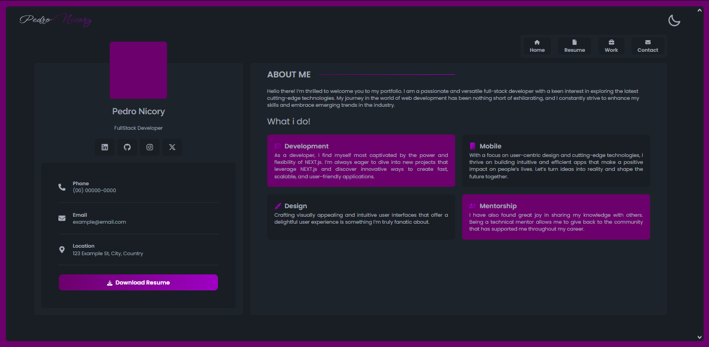

# PersonaFrame

This design was inspired in [Beatrice Wambui](https://www.figma.com/community/file/1264680769254941322) at [Figma Website](https://www.figma.com).

## Application Preview



👉 [Live Demo](https://portfolio-design-sigma-dun.vercel.app/)


> A beautiful portfolio design from a figma post made with NextJs and editable with personal data.

### Adjustments and Improvements

The project is still under development and the next updates will focus on the following tasks:

- [ ] **Scalability:** Ensure the application can handle growth and increased demand.
- [ x ] **Dark Mode:** Provide an option for a dark theme for comfortable viewing.
- [ ] **Personal Information Edits:** Allow customization with personal details. ( this is all the thing that's make this different )
- [ ] **Color Customization:** Enable users to change color schemes.
- [ x ] **Responsiveness:** Optimize the design for various devices and screen sizes.

## Scalability

The application is designed with scalability in mind. Future features and increasing content will be handled efficiently through:

- **Modular design:** Components are separated and reusable, promoting maintainability and scalability.
- **Efficient data structures:** Data is organized logically to minimize performance bottlenecks.
- **Cloud-based hosting:** Leveraging cloud infrastructure allows for easy scaling of resources as needed.

## 💻 Prerequisites

Before starting, ensure you meet the following requirements:

- You have installed the latest version of `Node 22`
- You have a `<Windows / Linux / Mac>` machine. Indicate which operating system is compatible / not compatible.

## 🚀 Installing PersonaFrame

To install PersonaFrame, follow these steps:

Linux and macOS:

```
git clone https://github.com/nicoryy/PersonaFrame
cd PersonaFrame
npm install
```

Windows:

```
git clone https://github.com/nicoryy/PersonaFrame
cd PersonaFrame
npm install
```

## ☕ Using PersonaFrame

To use PersonaFrame, just:

```
npm run dev
```

## 📫 Contributing to PersonaFrame

To contribute to PersonaFrame, follow these steps:

1. Fork this repository.
2. Create a branch: `git checkout -b <branch_name>`.
3. Make your changes and commit them: `git commit -m '<commit_message>'`
4. Push to the original branch: `git push origin PersonaFrame / <local>`
5. Create the pull request.

Alternatively, see the GitHub documentation on [how to create a pull request](https://help.github.com/en/github/collaborating-with-issues-and-pull-requests/creating-a-pull-request).
